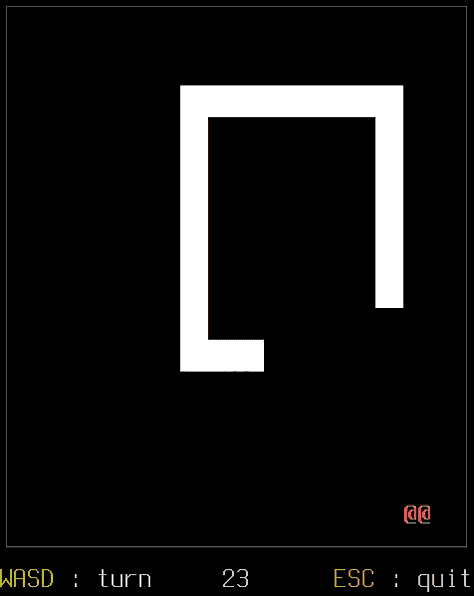

Snake!
======

Snake!

Made while learning [nim-lang](https://nim-lang.org/) and thinking about
gameplay variants for as a potential educational project.

Contents
--------

Several implementations of a very simple snake game:

* [nim + nico](nim-nico)
  a graphical implementation in [nim](https://nim-lang.org)
  using [nico](https://github.com/ftsf/nico).
* [nim + ill-will](nim-illwill/)
  a command-line implementation in [nim](https://nim-lang.org)
  using [illwill](https://github.com/johnnovak/illwill).
* [python](python/) abandoned partial implementation to get a feel for the
  data structures involved

TODO
----

This was a good, very basic early project while learning nim-lang, but this
is as far as I will take it for now.
Considering the following next steps (some day):

* Get the nico version to compile for web (having trouble installing
  emscripten for the headers to be picked up by the compiler).
* Make a multi-player variant. Implementation can probably get away with
  client-authoritative netcode or a simple rollback system.
* Make an AI to solve the game (single-player) and play against
  (multi-player).
* Make a [COMP30024-style project](https://github.com/matomatical/AI-games)
  out of the multi-player variant, perhaps with *real-time* as the 
  interesting challenging aspect for the year.
  (Note: Nim could be a good choice of language for a COMP30024-style class?)
* Maybe an implementation for Rust could be good too. This is a pretty good
  beginner project if you ask me.

Links
-----

Other snake games, from which I took some inspiration:

* The snake game on my nokia
* [dom96/snake](https://github.com/dom96/snake/)

